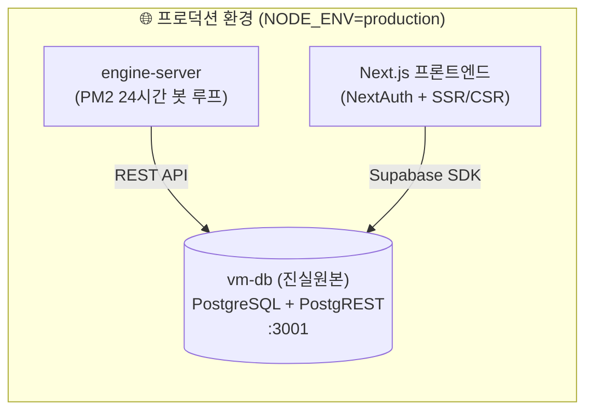

# 🏛️ MUMYEONG(무명) 아키텍처 및 데이터 소스 가이드

## 1. 🌟 단일 진실원본 (Single Source of Truth, SSOT)

실서비스(Production) 환경에서 '무명' 프로젝트의 모든 데이터는 **오직 `vm-db` (PostgreSQL + PostgREST) 하나만을 단일 진실원본**으로 사용합니다.



- **`engine-server`**: 1.5초 틱 무중단 루프로 50개 기관 봇 매칭, 원자재 선물 가격 갱신, 옵션/채권 만기 정산을 수행하며 모든 결과를 `vm-db`에 즉시 커밋합니다.
- **`Next.js 프론트엔드`**: `lib/supabase/client.ts` 및 `lib/supabase/server.ts`를 통해 `vm-db`에 직접 연결하여 실시간 체결 내역과 호가창을 유저에게 표시합니다.

---

## 2. 🛡️ 환경 분기 가드 및 Fail-Fast 정책

프로덕션 환경에서 실수로 인메모리 모드가 켜지거나 `vm-db` 연결이 누락되어 봇 거래와 유저 화면 간 데이터가 분리되는 문제를 원천 차단하기 위해 **엄격한 Fail-Fast 가드**가 적용되어 있습니다.

| 환경 | `NEXT_PUBLIC_USE_IN_MEMORY` | 동작 방식 |
|:---|:---:|:---|
| **Production (`NODE_ENV=production`)** | `true` | 🚨 **즉시 Error 발생 및 서버 기동/배포 실패 (`[SECURITY CRITICAL]`)** |
| **Production (`NODE_ENV=production`)** | `false` 또는 미지정 | ✅ **`vm-db` (PostgreSQL/PostgREST) 직접 연결** (연결 정보 누락 시 Silent fallback 없이 즉각 에러) |
| **Development (`NODE_ENV=development`)** | `true` | 💡 **로컬 인메모리(Mock) 모드 허용** (오프라인 데모/테스트 전용) |
| **Development (`NODE_ENV=development`)** | `false` | ✅ **로컬에서도 실제 `vm-db`에 연결** |

---

## 3. 💻 로컬 인메모리 데모 모드 사용법 (vm-db 없이 개발할 때)

외부 DB 설치나 `vm-db` 네트워크 연결 없이 로컬에서 오프라인으로 UI 개발 및 데모를 진행하고자 할 때 사용합니다.

1. `.env.local` 파일에 다음 환경변수 설정:
   ```bash
   NEXT_PUBLIC_USE_IN_MEMORY=true
   ```
2. 개발 서버 기동:
   ```bash
   npm run dev
   ```
3. 콘솔에 `⚠️ [DEV MODE] 오프라인 인메모리(Mock) 데이터베이스 모드로 동작합니다.` 로그가 출력되며, 삼성전자, SK하이닉스, 12개 원자재, 채권/옵션 마스터 데이터 및 1억원의 기본 잔고가 인메모리로 제공됩니다.
